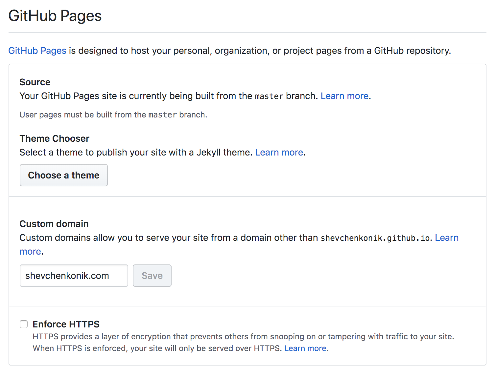

### Preamble

I had a this website on subdomain ```github.io``` and wanted a custom domain but I found some problems. My choice for domain name registrator is [*Internet.bs*](https://internetbs.net) and this article will be about integration Github Pages and Internet.bs.

### Part 1. Side of Github Pages

#### Step 1. Create repository

You can initialize new repository for a blog or you can clone that repository (in my case):
```
git clone https://github.com/heiswayi/thinkspace your-name-of-repo
```

#### Step 2. Repository Setup

All personal settings are in ```_config.yml``` and you can customize their.

#### Step 3. Publish Your Repository


#### Step 4. Adding Custom Domain in Github

You have two ways for adding custom domain:
- Adding ```CNAME``` in root directory of repository and write your domain.
```
your-domain.com
```

- Adding custom domain in repository settings



### Part 2. Side of Internet.bs

#### Step 1. Create domain

#### Step 2. Custom Domain Setup
