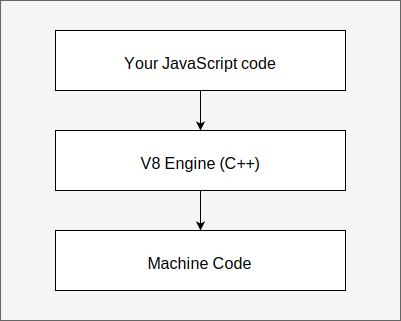

## Introduction

Javascript in the browser works a level above Javascript Engine ([V8](https://en.wikipedia.org/wiki/V8_(JavaScript_engine)), [Rhino](https://en.wikipedia.org/wiki/Rhino_(JavaScript_engine)), [JavaScriptCore](https://en.wikipedia.org/wiki/WebKit#JavaScriptCore), [SpiderMonkey](https://en.wikipedia.org/wiki/SpiderMonkey)). These engines follow the ECMAScript Standards. ECMAScript defines the standard for the scripting language. [1]

In this article we will use V8 Engine by Google. The V8 Engine:

- The V8 Engine is written in C++ and used in Chrome & in Node.js, among others.
- It implements ECMAScript Standard as specified in ECMA-262. [1]

More specific documentation of V8 Engine is available at [docs](https://v8.dev/docs#about-v8).

Main scheme of transform JavaScript code to Machine Code:

Every object takes a specific size in memory and C++ or ECMAScript depends this size.

## Boolean

Size: **4** bytes

A `boolean` is actually `1 byte`. But alignment may cause 4 bytes to be used on a 32-bit platform or 8 bytes on a 64-bit platform. This is an old trick that comes from the observation that allocated memory takes up at least 4 or 8 bytes, and are aligned in such a way that the least significant bit or three will be zero.

In C++, the size of the type `boolean` is implementation-defined ([expr.sizeof[p1]](http://eel.is/c++draft/expr.sizeof#1)) and is usually equal to 1 (the size of the type char, and the smallest size a type can have), but is not required to be ([expr.sizeof[fn77]](http://eel.is/c++draft/expr.sizeof#footnote-77)): in particular, in Visual Studio up to version 4.2, it was 4. More information about C++ boolean values is available at [docs[expr.sizeof(7.6.2.4)]](http://eel.is/c++draft/expr.sizeof#footnoteref-69[]).

## Resources

[1] –– [https://www.ecma-international.org/publications/standards/Ecma-262.htm](https://www.ecma-international.org/publications/standards/Ecma-262.htm)

[2] –– [https://www.quora.com/In-C%2B%2B-what-is-the-size-of-type-bool/answer/Sergey-Zubkov-1?ch=10&share=2471829a&srid=lXWU](https://www.quora.com/In-C%2B%2B-what-is-the-size-of-type-bool/answer/Sergey-Zubkov-1?ch=10&share=2471829a&srid=lXWU)

[3] –– [https://www.freecodecamp.org/news/understanding-the-core-of-nodejs-the-powerful-chrome-v8-engine-79e7eb8af964/](https://www.freecodecamp.org/news/understanding-the-core-of-nodejs-the-powerful-chrome-v8-engine-79e7eb8af964/)

[4] –– [https://stackoverflow.com/questions/32733314/in-v8-how-are-primitive-types-such-as-null-undefined-and-boolean-stored-in-me](https://stackoverflow.com/questions/32733314/in-v8-how-are-primitive-types-such-as-null-undefined-and-boolean-stored-in-me)